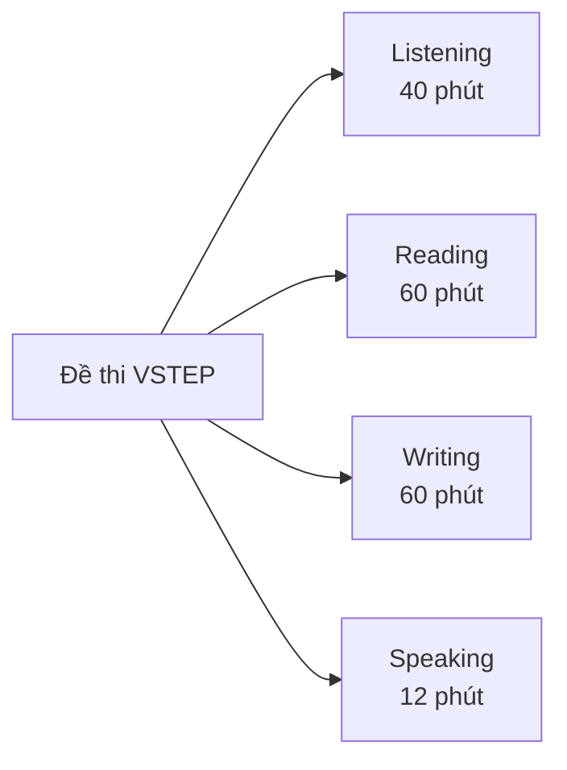

# Plan 1: Project Setup — Astro + Starlight + Custom Components

> **For agentic workers:** REQUIRED SUB-SKILL: Use superpowers:subagent-driven-development (recommended) or superpowers:executing-plans to implement this plan task-by-task. Steps use checkbox (`- [ ]`) syntax for tracking.

**Goal:** Scaffold an Astro + Starlight project with Vietnamese locale, TailwindCSS, React components, Mermaid diagrams, and a custom landing page — ready to receive content.

**Architecture:** Starlight docs framework with monolingual Vietnamese config. Custom React components (TierContent, VocabularyTable, TemplateBox, SampleAnswer, StudyTrack, TestCard) rendered in MDX pages. Tailwind v4 via Vite plugin. Landing page as standalone Astro page.

**Tech Stack:** Astro 5, Starlight, React 19, TailwindCSS v4, rehype-mermaid, TypeScript

**Spec:** `docs/superpowers/specs/2026-03-29-vstep-b1-website-design.md`

---

## File Structure

```
vstep-web/
├── astro.config.mjs
├── tsconfig.json
├── package.json
├── src/
│   ├── styles/
│   │   └── global.css
│   ├── content/
│   │   ├── docs/
│   │   │   └── getting-started/
│   │   │       └── what-is-vstep.mdx      (placeholder to verify setup)
│   │   └── i18n/
│   │       └── vi.json
│   ├── content.config.ts
│   ├── pages/
│   │   └── index.astro                    (custom landing page)
│   ├── components/
│   │   ├── TierContent.tsx
│   │   ├── VocabularyTable.tsx
│   │   ├── TemplateBox.tsx
│   │   ├── SampleAnswer.tsx
│   │   ├── StudyTrack.tsx
│   │   └── TestCard.tsx
│   └── data/
│       ├── vocabulary/
│       │   └── hobbies.json               (sample data to verify VocabularyTable)
│       └── study-tracks.json              (sample data to verify StudyTrack)
```

---

### Task 1: Scaffold Astro + Starlight project

**Files:**
- Create: `vstep-web/` (entire project directory)

- [ ] **Step 1: Create project with Starlight + Tailwind template**

```bash
cd /Users/michael/Desktop/vstep
npm create astro@latest -- --template starlight/tailwind --yes vstep-web
```

- [ ] **Step 2: Verify project runs**

```bash
cd /Users/michael/Desktop/vstep/vstep-web
npm run dev
```

Expected: Dev server starts at localhost:4321, default Starlight page loads.

- [ ] **Step 3: Stop dev server, verify .gitignore exists, init git, commit**

```bash
cd /Users/michael/Desktop/vstep/vstep-web
cat .gitignore  # verify node_modules is listed (Starlight template includes it)
git init
git add -A
git commit -m "chore: scaffold Astro + Starlight + Tailwind project"
```

Note: All subsequent commands assume cwd is `/Users/michael/Desktop/vstep/vstep-web`.

---

### Task 2: Configure Vietnamese locale + sidebar

**Files:**
- Modify: `vstep-web/astro.config.mjs`
- Create: `vstep-web/src/content/i18n/vi.json`
- Modify: `vstep-web/src/content.config.ts`

- [ ] **Step 1: Create Vietnamese i18n file**

Create `src/content/i18n/vi.json`:
```json
{
  "skipLink.label": "Bỏ qua đến nội dung",
  "search.label": "Tìm kiếm",
  "search.shortcutLabel": "(nhấn /)",
  "search.cancelLabel": "Hủy",
  "themeSelect.accessibleLabel": "Chọn giao diện",
  "themeSelect.dark": "Tối",
  "themeSelect.light": "Sáng",
  "themeSelect.auto": "Tự động",
  "menuButton.accessibleLabel": "Menu",
  "sidebarNav.accessibleLabel": "Điều hướng",
  "tableOfContents.onThisPage": "Trên trang này",
  "tableOfContents.overview": "Tổng quan",
  "page.editLink": "Chỉnh sửa trang",
  "page.lastUpdated": "Cập nhật lần cuối:",
  "page.previousLink": "Trước",
  "page.nextLink": "Tiếp theo",
  "404.text": "Không tìm thấy trang."
}
```

- [ ] **Step 2: Update content.config.ts to include i18n collection**

```ts
import { defineCollection } from 'astro:content';
import { docsLoader, i18nLoader } from '@astrojs/starlight/loaders';
import { docsSchema, i18nSchema } from '@astrojs/starlight/schema';

export const collections = {
  docs: defineCollection({ loader: docsLoader(), schema: docsSchema() }),
  i18n: defineCollection({ loader: i18nLoader(), schema: i18nSchema() }),
};
```

- [ ] **Step 3: Configure astro.config.mjs — Vietnamese locale + full sidebar**

```js
import { defineConfig } from 'astro/config';
import starlight from '@astrojs/starlight';
import tailwindcss from '@tailwindcss/vite';

export default defineConfig({
  integrations: [
    starlight({
      title: 'Ôn thi VSTEP B1',
      customCss: ['./src/styles/global.css'],
      locales: {
        root: {
          label: 'Tiếng Việt',
          lang: 'vi',
        },
      },
      sidebar: [
        {
          label: '📍 Bắt đầu từ đây',
          items: [
            { slug: 'getting-started/what-is-vstep', label: 'VSTEP B1 là gì?' },
            { slug: 'getting-started/scoring-criteria', label: 'Tiêu chí chấm' },
            { slug: 'getting-started/study-roadmap', label: 'Lộ trình ôn thi' },
          ],
        },
        {
          label: '🧱 Nền tảng',
          items: [
            { slug: 'foundation/vocabulary', label: 'Từ vựng theo chủ đề' },
            { slug: 'foundation/linking-words', label: 'Từ nối' },
            { slug: 'foundation/sentence-patterns', label: 'Cấu trúc câu' },
            { slug: 'foundation/sentence-upgrade', label: 'Nâng cấp câu' },
            { slug: 'foundation/common-mistakes', label: 'Lỗi thường gặp' },
          ],
        },
        {
          label: '🎧 Listening',
          items: [
            { slug: 'listening/format', label: 'Cấu trúc đề & dạng câu hỏi' },
            { slug: 'listening/strategies', label: 'Chiến lược làm bài' },
            { slug: 'listening/vocabulary', label: 'Từ vựng & mẹo nghe' },
          ],
        },
        {
          label: '📖 Reading',
          items: [
            { slug: 'reading/format', label: 'Cấu trúc đề & dạng câu hỏi' },
            { slug: 'reading/strategies', label: 'Chiến lược làm bài' },
            { slug: 'reading/vocabulary', label: 'Từ vựng đọc hiểu' },
          ],
        },
        {
          label: '🗣️ Speaking',
          items: [
            { slug: 'speaking/overview', label: 'Tổng quan' },
            { slug: 'speaking/part-1', label: 'Part 1: Tương tác xã hội' },
            { slug: 'speaking/part-2', label: 'Part 2: Thảo luận giải pháp' },
            { slug: 'speaking/part-3', label: 'Part 3: Phát triển chủ đề' },
            { slug: 'speaking/sample-answers', label: 'Bài mẫu có phân tích' },
          ],
        },
        {
          label: '✍️ Writing',
          items: [
            { slug: 'writing/overview', label: 'Tổng quan' },
            { slug: 'writing/formal-letter', label: 'Thư trang trọng (Formal)' },
            { slug: 'writing/informal-letter', label: 'Thư thân mật (Informal)' },
            { slug: 'writing/essay', label: 'Viết luận (Essay)' },
            { slug: 'writing/checklist', label: 'Checklist đạt B1' },
            { slug: 'writing/sample-answers', label: 'Bài mẫu có phân tích' },
          ],
        },
        {
          label: '📊 Phân tích đề thật',
          items: [
            { slug: 'exam-analysis', label: 'Tổng hợp 20 đề' },
          ],
        },
        {
          label: '✅ Checklist trước ngày thi',
          items: [
            { slug: 'checklist', label: 'Checklist 4 kỹ năng' },
          ],
        },
        {
          label: '📝 Đề thi thử',
          items: [
            { slug: 'practice-tests', label: 'Danh sách đề' },
            { slug: 'practice-tests/how-to-practice', label: 'Hướng dẫn luyện đề' },
          ],
        },
      ],
    }),
  ],
  vite: {
    plugins: [tailwindcss()],
  },
});
```

- [ ] **Step 4: Verify dev server runs with Vietnamese UI**

```bash
npm run dev
```

Expected: Vietnamese search label ("Tìm kiếm"), sidebar in Vietnamese, page lang="vi".

- [ ] **Step 5: Commit**

```bash
git add -A
git commit -m "feat: configure Vietnamese locale and full sidebar navigation"
```

---

### Task 3: Add React integration + path aliases

**Files:**
- Modify: `vstep-web/astro.config.mjs`
- Modify: `vstep-web/tsconfig.json`

- [ ] **Step 1: Add React integration**

```bash
npx astro add react --yes
```

- [ ] **Step 2: Configure path aliases in tsconfig.json**

```json
{
  "extends": "astro/tsconfigs/strict",
  "compilerOptions": {
    "baseUrl": ".",
    "paths": {
      "@components/*": ["src/components/*"],
      "@data/*": ["src/data/*"]
    }
  }
}
```

- [ ] **Step 3: Add Vite aliases in astro.config.mjs**

Add to the `vite` config block (alongside tailwindcss plugin):

```js
import path from 'path';

// inside defineConfig:
vite: {
  plugins: [tailwindcss()],
  resolve: {
    alias: {
      '@components': path.resolve('./src/components'),
      '@data': path.resolve('./src/data'),
    },
  },
},
```

- [ ] **Step 4: Verify by running dev server**

```bash
npm run dev
```

Expected: No errors.

- [ ] **Step 5: Commit**

```bash
git add -A
git commit -m "feat: add React integration and path aliases"
```

---

### Task 4: Add Mermaid diagram support

**Files:**
- Modify: `vstep-web/astro.config.mjs`
- Modify: `vstep-web/package.json`

- [ ] **Step 1: Install rehype-mermaid**

```bash
npm install rehype-mermaid
```

- [ ] **Step 2: Add to astro.config.mjs**

```js
import rehypeMermaid from 'rehype-mermaid';

// inside defineConfig:
markdown: {
  rehypePlugins: [[rehypeMermaid, { strategy: 'img-svg' }]],
},
```

Note: `img-svg` strategy renders Mermaid at build time as SVG images (no client JS needed).

- [ ] **Step 2b: Install Playwright chromium (required for rehype-mermaid)**

```bash
npx playwright install chromium
```

Expected: Chromium browser downloaded successfully.

- [ ] **Step 3: Create test page with Mermaid diagram**

Create `src/content/docs/getting-started/what-is-vstep.mdx`:
````mdx
---
title: VSTEP B1 là gì?
description: Tổng quan về kỳ thi VSTEP và cách đạt B1
---

## Cấu trúc đề thi VSTEP



Đây là trang placeholder. Nội dung sẽ được bổ sung ở Plan 2.
````

- [ ] **Step 4: Verify Mermaid renders**

```bash
npm run dev
```

Navigate to `/getting-started/what-is-vstep/`. Expected: Mermaid diagram renders as SVG image.

If Mermaid fails to render, verify Playwright chromium was installed in Step 2b.

- [ ] **Step 5: Commit**

```bash
git add -A
git commit -m "feat: add Mermaid diagram support"
```

---

### Task 5: Create TierContent component

**Files:**
- Create: `vstep-web/src/components/TierContent.tsx`

- [ ] **Step 1: Create TierContent component**

```tsx
// src/components/TierContent.tsx
import { useState, type ReactNode } from 'react';

interface TierContentProps {
  title?: string;
  defaultOpen?: boolean;
  children: ReactNode;
}

export default function TierContent({
  title = 'Nâng cao',
  defaultOpen = false,
  children,
}: TierContentProps) {
  const [isOpen, setIsOpen] = useState(defaultOpen);

  return (
    <details
      open={defaultOpen || undefined}
      onToggle={(e) => setIsOpen((e.target as HTMLDetailsElement).open)}
      className="tier-content my-4 rounded-lg border border-amber-300 bg-amber-50 dark:border-amber-700 dark:bg-amber-950"
    >
      <summary className="cursor-pointer select-none px-4 py-3 font-semibold text-amber-800 dark:text-amber-200">
        {isOpen ? '▼' : '▶'} {title}
      </summary>
      <div className="px-4 pb-4 pt-2">{children}</div>
    </details>
  );
}
```

Note: Uses `<details>` HTML element — content is visible/accessible with JS disabled (no-JS fallback: expanded). React adds toggle state for the arrow icon.

- [ ] **Step 2: Test in placeholder page**

Add to `src/content/docs/getting-started/what-is-vstep.mdx`:
```mdx
import TierContent from '@components/TierContent';

<TierContent title="Nâng cao — muốn điểm cao hơn" client:load>
  Nội dung nâng cao sẽ hiển thị ở đây.
</TierContent>
```

- [ ] **Step 3: Verify renders correctly**

```bash
npm run dev
```

Expected: Collapsible section with amber border, click to expand/collapse.

- [ ] **Step 4: Commit**

```bash
git add src/components/TierContent.tsx src/content/docs/getting-started/what-is-vstep.mdx
git commit -m "feat: add TierContent collapsible component for two-tier content"
```

---

### Task 6: Create VocabularyTable component

**Files:**
- Create: `vstep-web/src/components/VocabularyTable.tsx`
- Create: `vstep-web/src/data/vocabulary/hobbies.json`

- [ ] **Step 1: Create sample vocabulary data**

Create `src/data/vocabulary/hobbies.json`:
```json
[
  { "word": "hobby", "vietnamese": "sở thích", "example": "My hobby is reading books." },
  { "word": "relax", "vietnamese": "thư giãn", "example": "Reading helps me relax after work." },
  { "word": "enjoy", "vietnamese": "thích, tận hưởng", "example": "I enjoy playing football with my friends." },
  { "word": "spend time", "vietnamese": "dành thời gian", "example": "I spend time reading every evening." },
  { "word": "free time", "vietnamese": "thời gian rảnh", "example": "In my free time, I like watching movies." }
]
```

- [ ] **Step 2: Create VocabularyTable component**

```tsx
// src/components/VocabularyTable.tsx
import { useState } from 'react';

interface VocabEntry {
  word: string;
  vietnamese: string;
  example: string;
}

interface VocabularyTableProps {
  topic: string;
  data: VocabEntry[];
}

export default function VocabularyTable({ topic, data }: VocabularyTableProps) {
  const [filter, setFilter] = useState('');

  const filtered = data.filter(
    (entry) =>
      entry.word.toLowerCase().includes(filter.toLowerCase()) ||
      entry.vietnamese.toLowerCase().includes(filter.toLowerCase())
  );

  return (
    <div className="my-4">
      <h3 className="mb-2 text-lg font-bold">{topic}</h3>
      <input
        type="text"
        placeholder="Tìm từ..."
        value={filter}
        onChange={(e) => setFilter(e.target.value)}
        className="mb-3 w-full rounded border border-gray-300 px-3 py-2 text-sm dark:border-gray-600 dark:bg-gray-800"
      />
      <table className="w-full text-sm">
        <thead>
          <tr className="border-b border-gray-200 dark:border-gray-700">
            <th className="px-2 py-2 text-left font-semibold">Từ / Cụm từ</th>
            <th className="px-2 py-2 text-left font-semibold">Nghĩa</th>
            <th className="px-2 py-2 text-left font-semibold">Ví dụ</th>
          </tr>
        </thead>
        <tbody>
          {filtered.map((entry, i) => (
            <tr key={i} className="border-b border-gray-100 dark:border-gray-800">
              <td className="px-2 py-2 font-medium text-blue-700 dark:text-blue-300">{entry.word}</td>
              <td className="px-2 py-2">{entry.vietnamese}</td>
              <td className="px-2 py-2 italic text-gray-600 dark:text-gray-400">{entry.example}</td>
            </tr>
          ))}
          {filtered.length === 0 && (
            <tr>
              <td colSpan={3} className="px-2 py-4 text-center text-gray-400">
                Không tìm thấy từ nào.
              </td>
            </tr>
          )}
        </tbody>
      </table>
    </div>
  );
}
```

- [ ] **Step 3: Verify in dev server**

Add to `what-is-vstep.mdx` to test:
```mdx
import VocabularyTable from '@components/VocabularyTable';
import hobbiesData from '@data/vocabulary/hobbies.json';

<VocabularyTable topic="Sở thích (Hobbies)" data={hobbiesData} client:load />
```

```bash
npm run dev
```

Expected: Table renders, filter input works (type "relax" → shows 1 row).

Note: `client:load` is required for all stateful React components (useState). Without it, the filter input won't work. Same applies to StudyTrack, SampleAnswer, TierContent.

- [ ] **Step 4: Commit**

```bash
git add src/components/VocabularyTable.tsx src/data/vocabulary/hobbies.json
git commit -m "feat: add VocabularyTable component with client-side filter"
```

---

### Task 7: Create TemplateBox component

**Files:**
- Create: `vstep-web/src/components/TemplateBox.tsx`

- [ ] **Step 1: Create TemplateBox component**

```tsx
// src/components/TemplateBox.tsx
import type { ReactNode } from 'react';

interface TemplateBoxProps {
  title: string;
  children: ReactNode;
}

export default function TemplateBox({ title, children }: TemplateBoxProps) {
  return (
    <div className="my-4 rounded-lg border-2 border-blue-300 bg-blue-50 dark:border-blue-700 dark:bg-blue-950">
      <div className="rounded-t-md bg-blue-200 px-4 py-2 font-semibold text-blue-900 dark:bg-blue-800 dark:text-blue-100">
        📝 {title}
      </div>
      <div className="px-4 py-3 font-mono text-sm leading-relaxed">{children}</div>
    </div>
  );
}
```

- [ ] **Step 2: Commit**

```bash
git add src/components/TemplateBox.tsx
git commit -m "feat: add TemplateBox component for template display"
```

---

### Task 8: Create SampleAnswer component

**Files:**
- Create: `vstep-web/src/components/SampleAnswer.tsx`

- [ ] **Step 1: Create SampleAnswer component**

```tsx
// src/components/SampleAnswer.tsx
import { useState, type ReactNode } from 'react';

interface SampleAnswerProps {
  title: string;
  score?: string;
  defaultOpen?: boolean;
  children: ReactNode;
}

export default function SampleAnswer({
  title,
  score,
  defaultOpen = false,
  children,
}: SampleAnswerProps) {
  const [isOpen, setIsOpen] = useState(defaultOpen);

  return (
    <details
      open={defaultOpen || undefined}
      onToggle={(e) => setIsOpen((e.target as HTMLDetailsElement).open)}
      className="my-4 rounded-lg border border-green-300 bg-green-50 dark:border-green-700 dark:bg-green-950"
    >
      <summary className="cursor-pointer select-none px-4 py-3 font-semibold text-green-800 dark:text-green-200">
        {isOpen ? '▼' : '▶'} {title}
        {score && (
          <span className="ml-2 rounded bg-green-200 px-2 py-0.5 text-xs dark:bg-green-800">
            {score}
          </span>
        )}
      </summary>
      <div className="sample-answer px-4 pb-4 pt-2 leading-relaxed">{children}</div>
    </details>
  );
}
```

- [ ] **Step 2: Add annotation CSS classes to global.css**

Add to `src/styles/global.css`:
```css
/* SampleAnswer annotation colors */
.sample-answer .linking {
  color: #3b82f6;
  font-weight: 600;
}
.sample-answer .structure {
  color: #22c55e;
  font-weight: 600;
}
.sample-answer .vocab {
  color: #f97316;
  font-weight: 600;
}
```

- [ ] **Step 3: Commit**

```bash
git add src/components/SampleAnswer.tsx src/styles/global.css
git commit -m "feat: add SampleAnswer component with color-coded annotations"
```

---

### Task 9: Create StudyTrack component

**Files:**
- Create: `vstep-web/src/components/StudyTrack.tsx`

- [ ] **Step 1a: Create sample study-tracks data**

Create `src/data/study-tracks.json`:
```json
[
  {
    "name": "4 tuần cấp tốc",
    "weeks": [
      { "week": "1", "focus": "Nền tảng", "pages": "/foundation/vocabulary/", "tasks": "Học 5 chủ đề từ vựng" },
      { "week": "2", "focus": "Speaking + Writing", "pages": "/speaking/part-1/", "tasks": "Luyện Part 1" },
      { "week": "3", "focus": "Listening + Reading", "pages": "/listening/format/", "tasks": "Làm 3 đề thử" },
      { "week": "4", "focus": "Luyện đề", "pages": "/practice-tests/", "tasks": "Làm 5 đề thử" }
    ]
  },
  {
    "name": "8 tuần chuẩn",
    "weeks": [
      { "week": "1-2", "focus": "Nền tảng", "pages": "/foundation/vocabulary/", "tasks": "Học toàn bộ từ vựng + từ nối" }
    ]
  },
  {
    "name": "12 tuần kỹ",
    "weeks": [
      { "week": "1-3", "focus": "Nền tảng", "pages": "/foundation/vocabulary/", "tasks": "Học từ vựng + ngữ pháp" }
    ]
  }
]
```

- [ ] **Step 1b: Create StudyTrack component**

```tsx
// src/components/StudyTrack.tsx
import { useState } from 'react';

interface Week {
  week: string;
  focus: string;
  pages: string;
  tasks: string;
}

interface Track {
  name: string;
  weeks: Week[];
}

interface StudyTrackProps {
  tracks: Track[];
}

export default function StudyTrack({ tracks }: StudyTrackProps) {
  const [activeTab, setActiveTab] = useState(0);

  return (
    <div className="my-4">
      <div className="flex gap-1 border-b border-gray-200 dark:border-gray-700">
        {tracks.map((track, i) => (
          <button
            key={i}
            onClick={() => setActiveTab(i)}
            className={`px-4 py-2 text-sm font-medium rounded-t transition-colors ${
              activeTab === i
                ? 'bg-blue-100 text-blue-800 border-b-2 border-blue-600 dark:bg-blue-900 dark:text-blue-200'
                : 'text-gray-500 hover:text-gray-700 dark:text-gray-400'
            }`}
          >
            {track.name}
          </button>
        ))}
      </div>
      <table className="mt-3 w-full text-sm">
        <thead>
          <tr className="border-b border-gray-200 dark:border-gray-700">
            <th className="px-2 py-2 text-left">Tuần</th>
            <th className="px-2 py-2 text-left">Trọng tâm</th>
            <th className="px-2 py-2 text-left">Trang học</th>
            <th className="px-2 py-2 text-left">Bài tập</th>
          </tr>
        </thead>
        <tbody>
          {tracks[activeTab].weeks.map((week, i) => (
            <tr key={i} className="border-b border-gray-100 dark:border-gray-800">
              <td className="px-2 py-2 font-medium">{week.week}</td>
              <td className="px-2 py-2">{week.focus}</td>
              <td className="px-2 py-2">{week.pages}</td>
              <td className="px-2 py-2">{week.tasks}</td>
            </tr>
          ))}
        </tbody>
      </table>
    </div>
  );
}
```

- [ ] **Step 2: Commit**

```bash
git add src/components/StudyTrack.tsx
git commit -m "feat: add StudyTrack tab-based component for study roadmaps"
```

---

### Task 10: Create TestCard component

**Files:**
- Create: `vstep-web/src/components/TestCard.tsx`

- [ ] **Step 1: Create TestCard component**

```tsx
// src/components/TestCard.tsx
interface TestCardProps {
  number: number;
  topics: string[];
  links: { label: string; href: string }[];
}

export default function TestCard({ number, topics, links }: TestCardProps) {
  return (
    <div className="my-2 rounded-lg border border-gray-200 p-4 transition-shadow hover:shadow-md dark:border-gray-700">
      <div className="mb-2 flex items-center gap-2">
        <span className="rounded bg-blue-600 px-2 py-1 text-sm font-bold text-white">
          Đề {number}
        </span>
        <span className="text-sm text-gray-500">
          {topics.join(' · ')}
        </span>
      </div>
      {links.length > 0 && (
        <div className="flex flex-wrap gap-2">
          {links.map((link, i) => (
            <a
              key={i}
              href={link.href}
              className="rounded bg-gray-100 px-2 py-1 text-xs text-blue-600 hover:bg-blue-100 dark:bg-gray-800 dark:text-blue-400"
            >
              → {link.label}
            </a>
          ))}
        </div>
      )}
    </div>
  );
}
```

- [ ] **Step 2: Commit**

```bash
git add src/components/TestCard.tsx
git commit -m "feat: add TestCard component for practice test index"
```

---

### Task 11: Create custom landing page

**Files:**
- Create: `vstep-web/src/pages/index.astro`
- Delete: `vstep-web/src/content/docs/index.mdx` (if default exists)

- [ ] **Step 1: Remove default Starlight index if exists**

```bash
rm -f src/content/docs/index.mdx src/content/docs/index.md
```

- [ ] **Step 2: Create custom landing page**

```astro
---
// src/pages/index.astro
import StarlightPage from '@astrojs/starlight/components/StarlightPage.astro';
---

<StarlightPage frontmatter={{ title: 'Ôn thi VSTEP B1', template: 'splash' }}>
  <div class="mx-auto max-w-4xl px-4 py-8">
    <div class="mb-8 text-center">
      <h1 class="mb-4 text-4xl font-bold">Ôn thi VSTEP B1</h1>
      <p class="text-lg text-gray-600 dark:text-gray-300">
        Tài liệu tự ôn thi VSTEP B1 cho sinh viên đại học.<br />
        Từ con số 0 đến đạt điểm B1 — có lộ trình, có chiến lược, có bài mẫu.
      </p>
      <a
        href="/getting-started/what-is-vstep/"
        class="mt-4 inline-block rounded-lg bg-blue-600 px-6 py-3 font-semibold text-white hover:bg-blue-700"
      >
        Bắt đầu từ đây →
      </a>
    </div>

    <div class="grid gap-4 sm:grid-cols-2 lg:grid-cols-3">
      <a href="/listening/format/" class="group rounded-lg border border-gray-200 p-6 transition-shadow hover:shadow-lg dark:border-gray-700">
        <div class="mb-2 text-2xl">🎧</div>
        <h2 class="mb-1 text-xl font-bold group-hover:text-blue-600">Listening</h2>
        <p class="text-sm text-gray-500">Chiến lược nghe, từ vựng, mẹo làm bài</p>
      </a>

      <a href="/reading/format/" class="group rounded-lg border border-gray-200 p-6 transition-shadow hover:shadow-lg dark:border-gray-700">
        <div class="mb-2 text-2xl">📖</div>
        <h2 class="mb-1 text-xl font-bold group-hover:text-blue-600">Reading</h2>
        <p class="text-sm text-gray-500">Chiến lược đọc, từ vựng, quản lý thời gian</p>
      </a>

      <a href="/speaking/overview/" class="group rounded-lg border border-gray-200 p-6 transition-shadow hover:shadow-lg dark:border-gray-700">
        <div class="mb-2 text-2xl">🗣️</div>
        <h2 class="mb-1 text-xl font-bold group-hover:text-blue-600">Speaking</h2>
        <p class="text-sm text-gray-500">Templates, bài mẫu, chủ đề hay gặp</p>
      </a>

      <a href="/writing/overview/" class="group rounded-lg border border-gray-200 p-6 transition-shadow hover:shadow-lg dark:border-gray-700">
        <div class="mb-2 text-2xl">✍️</div>
        <h2 class="mb-1 text-xl font-bold group-hover:text-blue-600">Writing</h2>
        <p class="text-sm text-gray-500">Viết thư, viết luận, checklist đạt B1</p>
      </a>

      <a href="/foundation/vocabulary/" class="group rounded-lg border border-gray-200 p-6 transition-shadow hover:shadow-lg dark:border-gray-700">
        <div class="mb-2 text-2xl">📚</div>
        <h2 class="mb-1 text-xl font-bold group-hover:text-blue-600">Từ vựng</h2>
        <p class="text-sm text-gray-500">15-20 chủ đề, từ nối, cấu trúc câu</p>
      </a>

      <a href="/practice-tests/" class="group rounded-lg border border-gray-200 p-6 transition-shadow hover:shadow-lg dark:border-gray-700">
        <div class="mb-2 text-2xl">📝</div>
        <h2 class="mb-1 text-xl font-bold group-hover:text-blue-600">Đề thi thử</h2>
        <p class="text-sm text-gray-500">20 đề thi thật + hướng dẫn luyện đề</p>
      </a>
    </div>
  </div>
</StarlightPage>
```

- [ ] **Step 3: Verify landing page loads at /**

```bash
npm run dev
```

Expected: Custom landing page with 6 skill cards at root URL.

- [ ] **Step 4: Commit**

```bash
git add -A
git commit -m "feat: add custom Vietnamese landing page with skill cards"
```

---

### Task 12: Create placeholder pages for all sidebar items

**Files:**
- Create: All `.mdx` files listed in the file structure (one-liner placeholders)

- [ ] **Step 1: Create all placeholder .mdx files**

Create each file with minimal frontmatter so Starlight doesn't error on missing pages:

```bash
# Getting Started
mkdir -p src/content/docs/getting-started
# what-is-vstep.mdx already exists from Task 4

cat > src/content/docs/getting-started/scoring-criteria.mdx << 'EOF'
---
title: Tiêu chí chấm
description: Tiêu chí chấm điểm từng kỹ năng VSTEP
---

Nội dung sẽ được bổ sung.
EOF

cat > src/content/docs/getting-started/study-roadmap.mdx << 'EOF'
---
title: Lộ trình ôn thi
description: Lộ trình ôn thi VSTEP B1 theo 3 mức thời gian
---

Nội dung sẽ được bổ sung.
EOF

# Foundation
mkdir -p src/content/docs/foundation
for f in vocabulary linking-words sentence-patterns sentence-upgrade common-mistakes; do
  cat > "src/content/docs/foundation/$f.mdx" << EOF
---
title: $(echo $f | tr '-' ' ')
description: Placeholder
---

Nội dung sẽ được bổ sung.
EOF
done

# Listening
mkdir -p src/content/docs/listening
for f in format strategies vocabulary; do
  cat > "src/content/docs/listening/$f.mdx" << EOF
---
title: $(echo $f | tr '-' ' ')
description: Placeholder
---

Nội dung sẽ được bổ sung.
EOF
done

# Reading
mkdir -p src/content/docs/reading
for f in format strategies vocabulary; do
  cat > "src/content/docs/reading/$f.mdx" << EOF
---
title: $(echo $f | tr '-' ' ')
description: Placeholder
---

Nội dung sẽ được bổ sung.
EOF
done

# Speaking
mkdir -p src/content/docs/speaking
for f in overview part-1 part-2 part-3 sample-answers; do
  cat > "src/content/docs/speaking/$f.mdx" << EOF
---
title: $(echo $f | tr '-' ' ')
description: Placeholder
---

Nội dung sẽ được bổ sung.
EOF
done

# Writing
mkdir -p src/content/docs/writing
for f in overview formal-letter informal-letter essay checklist sample-answers; do
  cat > "src/content/docs/writing/$f.mdx" << EOF
---
title: $(echo $f | tr '-' ' ')
description: Placeholder
---

Nội dung sẽ được bổ sung.
EOF
done

# Exam Analysis
mkdir -p src/content/docs/exam-analysis
cat > src/content/docs/exam-analysis/index.mdx << 'EOF'
---
title: Phân tích đề thật
description: Tổng hợp phân tích 20 đề thi VSTEP thật
---

Nội dung sẽ được bổ sung.
EOF

# Checklist
mkdir -p src/content/docs/checklist
cat > src/content/docs/checklist/index.mdx << 'EOF'
---
title: Checklist trước ngày thi
description: Checklist ôn tập 4 kỹ năng trước ngày thi
---

Nội dung sẽ được bổ sung.
EOF

# Practice Tests
mkdir -p src/content/docs/practice-tests
cat > src/content/docs/practice-tests/index.mdx << 'EOF'
---
title: Danh sách đề thi thử
description: Ngân hàng đề thi VSTEP
---

Nội dung sẽ được bổ sung.
EOF

cat > src/content/docs/practice-tests/how-to-practice.mdx << 'EOF'
---
title: Hướng dẫn luyện đề
description: Cách luyện đề thi VSTEP hiệu quả
---

Nội dung sẽ được bổ sung.
EOF
```

- [ ] **Step 2: Verify all sidebar links work**

```bash
npm run dev
```

Click through every sidebar item. Expected: All pages load with "Nội dung sẽ được bổ sung" placeholder.

- [ ] **Step 3: Commit**

```bash
git add -A
git commit -m "feat: add placeholder pages for all sidebar items"
```

---

### Task 13: Verify full build

- [ ] **Step 1: Run production build**

```bash
npm run build
```

Expected: Build succeeds with no errors. All pages generated.

- [ ] **Step 2: Preview production build**

```bash
npm run preview
```

Expected: Site loads at localhost:4321, all pages accessible, landing page works, sidebar navigation works, Mermaid diagram renders.

- [ ] **Step 3: Final commit**

```bash
git add -A
git commit -m "chore: verify production build passes"
```

---

## Plan 1 Complete

After this plan, the project has:
- ✅ Astro + Starlight running with Vietnamese locale
- ✅ TailwindCSS v4 configured
- ✅ Mermaid diagram support
- ✅ React integration with path aliases
- ✅ 6 custom components (TierContent, VocabularyTable, TemplateBox, SampleAnswer, StudyTrack, TestCard)
- ✅ Custom landing page with skill cards
- ✅ Full sidebar navigation with all placeholder pages
- ✅ Production build passes

**Next:** Plan 2 (Foundation Content) fills in the foundation pages with actual content.
